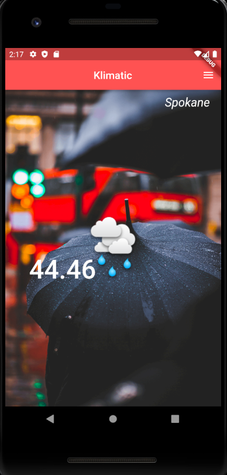
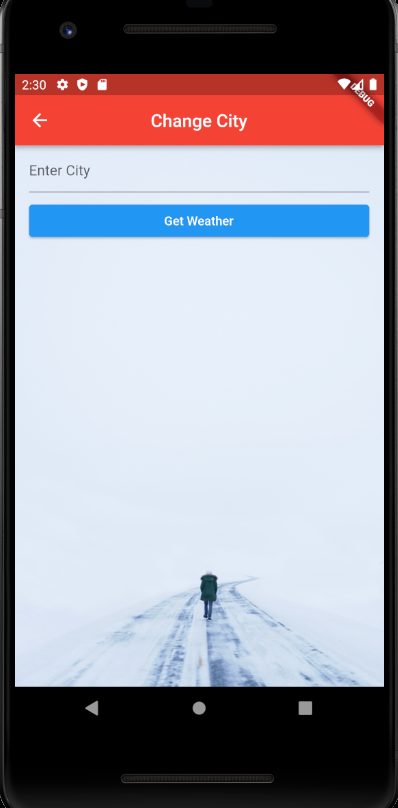

# Weather Application

- A mobile application to check weather of any city in the world.
- Application was developed and created using Flutter.
- Weather information was fetched using [Open Weather API](https://openweathermap.org/).

 

 
